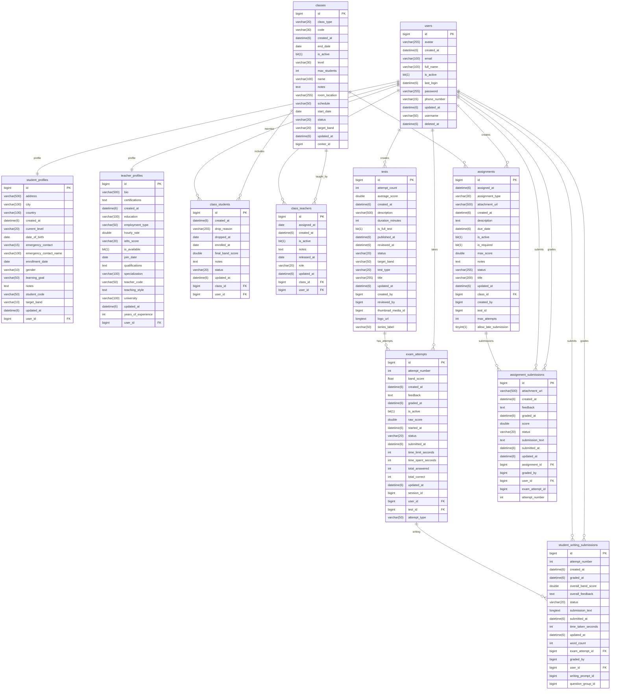

# DAVictory Student-Teacher ERD

This file focuses on the student/candidate and teacher flows only. It keeps the real tables, but limits the diagram to the smallest useful set so the ERD stays readable.

Note: this is intentionally smaller than the physical schema so it can be used as a student-teacher ERD for explanation and presentation.
