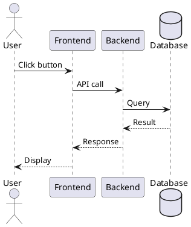
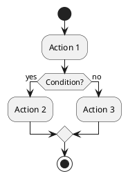

# HƯỚNG DẪN SỬ DỤNG CÁC BIỂU ĐỒ UML

## Tổng quan

Thư mục này chứa các biểu đồ UML quan trọng cho hệ thống DAVictory IELTS. Các biểu đồ được viết bằng PlantUML format (.puml).

## Danh sách các file biểu đồ

### 1. sequence_diagrams.puml
Chứa các biểu đồ tuần tự (Sequence Diagrams) mô tả luồng tương tác giữa các thành phần:

- **Đăng nhập**: Luồng xác thực người dùng với JWT
- **Đăng ký**: Luồng tạo tài khoản mới
- **Tạo đề thi**: Luồng giáo viên tạo đề thi với Test Builder
- **Làm bài thi**: Luồng học viên làm bài thi với auto-save
- **Chấm bài Writing**: Luồng giáo viên chấm bài Writing theo 4 tiêu chí
- **Quản lý lớp học**: Luồng tạo lớp và thêm học viên
- **Giao bài tập (Assignment)**: Luồng tạo và quản lý Assignment
- **Xem thống kê**: Luồng xem báo cáo và thống kê lớp học
- **Thi thử cho khách**: Luồng khách làm bài thi thử không cần đăng nhập

### 2. user_flow_diagrams.puml
Chứa các biểu đồ luồng người dùng (User Flow / Activity Diagrams):

- **User Flow - Học viên làm bài thi**: Luồng hoàn chỉnh từ chọn đề thi đến xem kết quả
- **User Flow - Giáo viên tạo đề thi**: Luồng tạo đề thi với các bước chi tiết
- **User Flow - Giáo viên chấm bài Writing**: Luồng chấm điểm Writing với 4 tiêu chí IELTS
- **User Flow - Giáo viên quản lý lớp học**: Luồng quản lý lớp, thêm học viên, giao bài tập
- **User Flow - Học viên xem kết quả và tiến độ**: Luồng xem lịch sử, Assignment, theo dõi tiến độ
- **User Flow - Admin quản trị hệ thống**: Luồng quản lý người dùng, đề thi, cấu hình
- **User Flow - Khách làm bài thi thử**: Luồng thi thử cho người chưa đăng ký

### 3. DAVictory_core_erd.puml (đã có sẵn)
Sơ đồ ERD (Entity Relationship Diagram) mô tả cấu trúc cơ sở dữ liệu.

## Cách xem biểu đồ

### Phương pháp 1: Sử dụng PlantUML Online
1. Truy cập: https://www.plantuml.com/plantuml/uml/
2. Copy nội dung từ file .puml
3. Paste vào editor
4. Xem kết quả render

### Phương pháp 2: Sử dụng VS Code
1. Cài đặt extension "PlantUML" trong VS Code
2. Mở file .puml
3. Nhấn `Alt + D` để preview

### Phương pháp 3: Sử dụng PlantUML CLI
```bash
# Cài đặt PlantUML
sudo apt-get install plantuml

# Generate PNG từ file .puml
plantuml sequence_diagrams.puml

# Generate SVG
plantuml -tsvg sequence_diagrams.puml

# Generate tất cả biểu đồ trong thư mục
plantuml *.puml
```

### Phương pháp 4: Sử dụng Docker
```bash
# Pull PlantUML Docker image
docker pull plantuml/plantuml

# Generate biểu đồ
docker run --rm -v $(pwd):/data plantuml/plantuml sequence_diagrams.puml
```

## Cách chỉnh sửa biểu đồ

### Sequence Diagram Syntax



### Activity Diagram Syntax



## Export biểu đồ cho báo cáo

### Export PNG (cho Word/PDF)
```bash
plantuml -tpng sequence_diagrams.puml
```

### Export SVG (cho web/vector)
```bash
plantuml -tsvg sequence_diagrams.puml
```

### Export PDF
```bash
plantuml -tpdf sequence_diagrams.puml
```

## Tích hợp vào báo cáo

### Trong Word
1. Export biểu đồ ra PNG
2. Insert → Pictures → chọn file PNG
3. Thêm caption: "Hình X. Tên biểu đồ"

### Trong LaTeX
```latex
\begin{figure}[h]
\centering
\includegraphics[width=0.8\textwidth]{sequence_diagrams.png}
\caption{Sơ đồ tuần tự - Đăng nhập}
\label{fig:login-sequence}
\end{figure}
```

### Trong Markdown
```markdown

```

## Các biểu đồ quan trọng cần đưa vào báo cáo

### Phần 2.2.1.4 - Mô hình Use Case
- Đã có trong báo cáo (Hình 15-33)

### Phần 2.2.1.5 - Sơ đồ tuần tự (Sequence Diagrams)
Nên thêm các biểu đồ sau:

1. **Sơ đồ tuần tự - Đăng nhập** (từ sequence_diagrams.puml)
   - Mô tả: Luồng xác thực người dùng với JWT
   - Vị trí đề xuất: Sau Use Case đăng nhập

2. **Sơ đồ tuần tự - Tạo đề thi** (từ sequence_diagrams.puml)
   - Mô tả: Luồng giáo viên tạo đề thi phức tạp
   - Vị trí đề xuất: Phần Test Builder

3. **Sơ đồ tuần tự - Làm bài thi** (từ sequence_diagrams.puml)
   - Mô tả: Luồng học viên làm bài với auto-save và chấm điểm tự động
   - Vị trí đề xuất: Phần Exam Attempt

4. **Sơ đồ tuần tự - Chấm bài Writing** (từ sequence_diagrams.puml)
   - Mô tả: Luồng giáo viên chấm bài Writing theo 4 tiêu chí IELTS
   - Vị trí đề xuất: Phần Manual Grading

### Phần 2.2.1.6 - Sơ đồ hoạt động (Activity Diagrams)
Nên thêm các biểu đồ sau:

1. **User Flow - Học viên làm bài thi** (từ user_flow_diagrams.puml)
   - Mô tả: Luồng hoàn chỉnh từ chọn đề đến xem kết quả
   - Vị trí đề xuất: Phần chức năng làm bài thi

2. **User Flow - Giáo viên tạo đề thi** (từ user_flow_diagrams.puml)
   - Mô tả: Luồng tạo đề thi với các bước chi tiết
   - Vị trí đề xuất: Phần Test Builder

3. **User Flow - Giáo viên quản lý lớp học** (từ user_flow_diagrams.puml)
   - Mô tả: Luồng quản lý lớp, giao bài tập, xem thống kê
   - Vị trí đề xuất: Phần Class Management

## Gợi ý cải thiện báo cáo

### Thêm vào Phần 2.2.1
Sau phần "Mô hình Use Case", nên thêm:

#### 2.2.1.5. Sơ đồ tuần tự (Sequence Diagrams)
Mô tả chi tiết luồng tương tác giữa các thành phần trong hệ thống:

**Hình X. Sơ đồ tuần tự - Đăng nhập**
[Insert biểu đồ]

Giải thích:
- User nhập username và password
- Frontend gửi request đến AuthController
- AuthController gọi UserService để xác thực
- UserService query database và kiểm tra password
- Nếu đúng, JwtUtil generate token
- Token được trả về Frontend và lưu vào localStorage

**Hình Y. Sơ đồ tuần tự - Làm bài thi**
[Insert biểu đồ]

Giải thích:
- Student bắt đầu làm bài thi
- Hệ thống tạo ExamAttempt và khởi tạo câu trả lời
- Trong quá trình làm bài, hệ thống auto-save mỗi 30 giây
- Khi nộp bài, hệ thống chấm điểm tự động và tính band score
- Kết quả được hiển thị ngay lập tức

#### 2.2.1.6. Sơ đồ hoạt động (Activity Diagrams)
Mô tả luồng hoạt động chi tiết của người dùng:

**Hình Z. User Flow - Học viên làm bài thi**
[Insert biểu đồ]

Giải thích:
- Học viên đăng nhập và chọn đề thi
- Xem thông tin đề thi và bắt đầu làm bài
- Trả lời từng câu hỏi với auto-save
- Review và nộp bài
- Xem kết quả và giải thích đáp án

## Lưu ý khi sử dụng

1. **Chất lượng hình ảnh**: Export với độ phân giải cao (300 DPI) cho báo cáo in
2. **Kích thước**: Điều chỉnh kích thước phù hợp với trang A4
3. **Caption**: Luôn thêm caption và số thứ tự hình
4. **Giải thích**: Thêm đoạn giải thích ngắn gọn sau mỗi biểu đồ
5. **Tham chiếu**: Tham chiếu đến biểu đồ trong nội dung: "Như thể hiện trong Hình X..."

## Công cụ hỗ trợ

### PlantUML Editors
- **VS Code**: Extension "PlantUML"
- **IntelliJ IDEA**: Plugin "PlantUML integration"
- **Eclipse**: Plugin "PlantUML"
- **Online**: https://www.plantuml.com/plantuml/

### Diagram Viewers
- **PlantUML Viewer**: Chrome extension
- **PlantUML QEditor**: Standalone editor
- **Draw.io**: Import PlantUML code

## Tài liệu tham khảo

- PlantUML Official Guide: https://plantuml.com/guide
- PlantUML Sequence Diagram: https://plantuml.com/sequence-diagram
- PlantUML Activity Diagram: https://plantuml.com/activity-diagram-beta
- UML Best Practices: https://www.uml-diagrams.org/

## Liên hệ

Nếu có thắc mắc về các biểu đồ, vui lòng liên hệ:
- **Sinh viên**: Nguyễn Lê Duy
- **Email**: [email]
- **Giảng viên hướng dẫn**: Ths. Nguyễn Khắc Quốc

---

**Cập nhật lần cuối**: 17/04/2026
